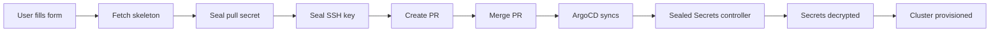

# HCP Cluster Template with Sealed Secrets

This Backstage template provisions OpenShift Hosted Control Plane (HCP) clusters with **automatically sealed secrets** for enhanced security.

## Features

- ✅ **Automated Secret Sealing**: Pull secrets and SSH keys are sealed using Kubeseal before being committed to Git
- ✅ **GitOps Ready**: Sealed secrets can be safely stored in Git repositories
- ✅ **Developer Hub Integration**: Fully integrated with Red Hat Developer Hub
- ✅ **Secure by Default**: No plain-text secrets in your Git history

## How It Works

1. **User provides secrets**: User enters pull secret and SSH public key in the Developer Hub UI
2. **Template generates manifests**: Skeleton files are populated with cluster configuration
3. **Secrets are sealed**: Kubeseal encrypts the secrets using the cluster's public key
4. **Safe Git commit**: Only SealedSecret resources are committed to Git
5. **ArgoCD syncs**: ArgoCD deploys the SealedSecrets to the cluster
6. **Controller decrypts**: Sealed Secrets controller decrypts and creates the actual Secrets

## Prerequisites

### Required Tools

- `kubeseal` CLI installed
- `kubectl` configured with access to the management cluster
- Sealed Secrets controller deployed on the target cluster

### Install Kubeseal

```bash
# macOS
brew install kubeseal

# Linux
wget https://github.com/bitnami-labs/sealed-secrets/releases/download/v0.24.0/kubeseal-0.24.0-linux-amd64.tar.gz
tar -xvzf kubeseal-0.24.0-linux-amd64.tar.gz
sudo install -m 755 kubeseal /usr/local/bin/kubeseal
```

### Install Sealed Secrets Controller

If not already installed on your cluster:

```bash
kubectl apply -f https://github.com/bitnami-labs/sealed-secrets/releases/download/v0.24.0/controller.yaml
```

## Backstage Configuration

The template uses the `shell:command` action to run kubeseal. This requires the **Scaffolder Backend Module Exec** plugin.

### Install the Plugin

Add to your Backstage `packages/backend/package.json`:

```json
{
  "dependencies": {
    "@backstage/plugin-scaffolder-backend-module-exec": "^0.2.0"
  }
}
```

Update your `packages/backend/src/index.ts`:

```typescript
import { createBackend } from '@backstage/backend-defaults';

const backend = createBackend();

// ... other plugins ...

backend.add(import('@backstage/plugin-scaffolder-backend-module-exec'));

backend.start();
```

## Manual Sealing (Fallback)

If the Backstage template doesn't have the exec plugin, you can seal secrets manually using the provided script:

```bash
cd clusters/your-cluster-name

../../../developer-hub/templates/hcp-cluster-template/seal-secrets.sh \
  "your-cluster-name" \
  "$(cat /path/to/pull-secret.json)" \
  "$(cat ~/.ssh/id_rsa.pub)"
```

This will create sealed versions of `base/pull-secret.yaml` and `base/ssh-key.yaml`.

## Template Parameters

| Parameter | Required | Description |
|-----------|----------|-------------|
| `clusterName` | ✅ | Name of the cluster (lowercase, alphanumeric, hyphens) |
| `baseDomain` | ✅ | Base domain for cluster DNS |
| `pullSecret` | ✅ | Red Hat pull secret (JSON from console.redhat.com) |
| `sshPublicKey` | ✅ | SSH public key for node access |
| `workerReplicas` | ✅ | Number of worker nodes (1-10) |
| `cpuCores` | ✅ | CPU cores per worker |
| `memoryGi` | ✅ | Memory in GiB per worker |

## Workflow



## Security Benefits

1. **No Plain-Text Secrets in Git**: All secrets are encrypted before committing
2. **Namespace-Scoped**: Secrets can only be decrypted in their target namespace
3. **Cluster-Specific**: Sealed secrets can only be decrypted by the target cluster
4. **Audit Trail**: Full Git history without exposing sensitive data

## Troubleshooting

### Kubeseal not found

Ensure kubeseal is installed and in your PATH:

```bash
which kubeseal
kubeseal --version
```

### Sealed Secrets controller not found

Verify the controller is running:

```bash
kubectl get pods -n sealed-secrets
kubectl get svc -n sealed-secrets sealed-secrets-controller
```

### Wrong controller namespace

If your Sealed Secrets controller is in a different namespace, update the `seal-secrets.sh` script or template.yaml step:

```bash
--controller-namespace=<your-namespace> \
--controller-name=<your-controller-name>
```

### Manual unsealing for debugging

To verify a sealed secret:

```bash
kubeseal --recovery-unseal --recovery-private-key <key-file> < sealed-secret.yaml
```

## Files

- `template.yaml` - Backstage template definition with sealing step
- `seal-secrets.sh` - Standalone script for manual sealing
- `skeleton/` - Template files for cluster resources
  - `base/pull-secret.yaml` - Pull secret template (will be sealed)
  - `base/ssh-key.yaml` - SSH key template (will be sealed)
  - `base/hostedcluster.yaml` - HostedCluster resource
  - `base/nodepool.yaml` - NodePool resource

## Support

For issues or questions:
- Check the [Sealed Secrets documentation](https://github.com/bitnami-labs/sealed-secrets)
- Review [Backstage scaffolder docs](https://backstage.io/docs/features/software-templates/)
- Check cluster logs: `oc logs -n sealed-secrets -l name=sealed-secrets-controller`
